 

  
  &nbsp;•&nbsp;
  
  &nbsp;•&nbsp;
  
  &nbsp;•&nbsp;
  
  &nbsp;•&nbsp;
  
  &nbsp;•&nbsp;
  

 

  <a href="#">
  <picture>
    <source media="(prefers-color-scheme: light)" srcset="text/dark.svg">
    <source media="(prefers-color-scheme: dark)" srcset="text/light.svg">
    
  </picture>
  </a>

